# Manuale per gli amministratori — Impostare la "Messa di oggi"

*Libretto Digitale dei Canti — Unità Pastorale Don Ennio Melioli*

---

## Indice

1. [A cosa serve](#1-a-cosa-serve)
2. [Prima di iniziare](#2-prima-di-iniziare)
3. [Aprire la pagina di amministrazione](#3-aprire-la-pagina-di-amministrazione)
4. [Panoramica della pagina](#4-panoramica-della-pagina)
5. [Inserire la password](#5-inserire-la-password)
6. [Scegliere la chiesa](#6-scegliere-la-chiesa)
7. [Aggiungere un canto](#7-aggiungere-un-canto)
8. [Scegliere il canto](#8-scegliere-il-canto)
9. [Modificare il momento della Messa](#9-modificare-il-momento-della-messa)
10. [Cambiare l'ordine dei canti](#10-cambiare-lordine-dei-canti)
11. [Rimuovere un canto](#11-rimuovere-un-canto)
12. [Salvare](#12-salvare)
13. [Controllare il risultato](#13-controllare-il-risultato)
14. [Messaggi e problemi comuni](#14-messaggi-e-problemi-comuni)
15. [Regole d'oro](#15-regole-doro)
16. [Riepilogo veloce](#16-riepilogo-veloce)

---

## 1. A cosa serve

Nella pagina principale del libretto c'è la sezione **"La Messa di oggi"**: mostra, per ogni chiesa, l'elenco dei canti scelti per la celebrazione (Inizio, Offertorio, Comunione, Fine…). I fedeli la vedono appena inquadrano il QR code e possono aprire ogni canto con un tocco.

Questo manuale spiega come l'amministratore imposta quei canti.

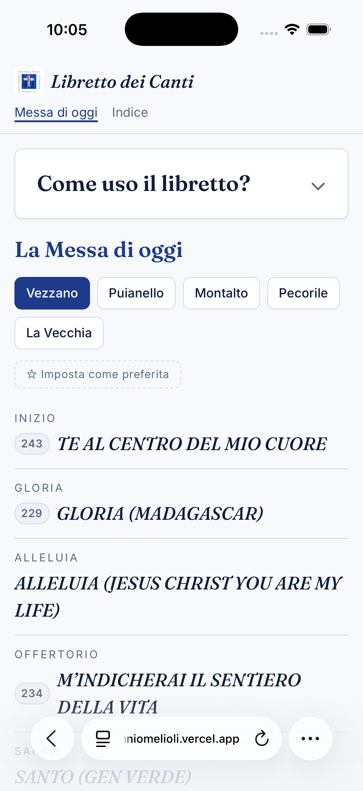

> 📸 **Screenshot 01** — Pagina principale del libretto (da telefono), con la sezione "La Messa di oggi" compilata per una chiesa: si vedono le schede delle chiese, l'elenco dei canti con il momento (Inizio, Offertorio…) e la scritta "Aggiornato: …" in fondo.

---

## 2. Prima di iniziare

Ti servono:

- **L'indirizzo del sito** del libretto: `https://up-donenniomelioli.vercel.app`
- **La password di amministrazione**, che ti viene comunicata dal responsabile del libretto. Non condividerla e non scriverla in luoghi pubblici.
- **L'elenco dei canti** scelti per la Messa, per ciascuna chiesa che devi aggiornare.

Puoi usare un computer, un tablet o un telefono: tutte le funzioni sono disponibili su ogni dispositivo.

---

## 3. Aprire la pagina di amministrazione

La pagina di amministrazione **non è collegata dai menu** del sito: va aperta scrivendo l'indirizzo a mano.

1. Apri il browser (Chrome, Safari, Firefox, Edge…).
2. Nella barra degli indirizzi scrivi:

   ```
   https://<INDIRIZZO-DEL-SITO>/admin
   ```

3. Premi Invio.

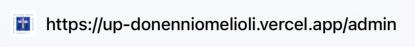

> 📸 **Screenshot 02** — Barra degli indirizzi del browser con l'indirizzo `…/admin` scritto (evidenziare la parte `/admin`).

Mentre la pagina si carica compare per un attimo la scritta **"Caricamento lista corrente…"**: il sito sta recuperando i canti già salvati, così parti da quelli e non da zero.

Se il caricamento non riesce compare **"Errore nel caricamento della lista corrente."** con il pulsante **Riprova**. Finché i canti non sono stati caricati le schede delle chiese e l'elenco dei canti non vengono mostrati e il pulsante **Salva** resta disattivato: così non si rischia di cancellare per errore i canti già pubblicati.

> 💡 **Consiglio:** salva l'indirizzo `/admin` tra i preferiti del browser, così la prossima volta lo apri con un clic.

---

## 4. Panoramica della pagina

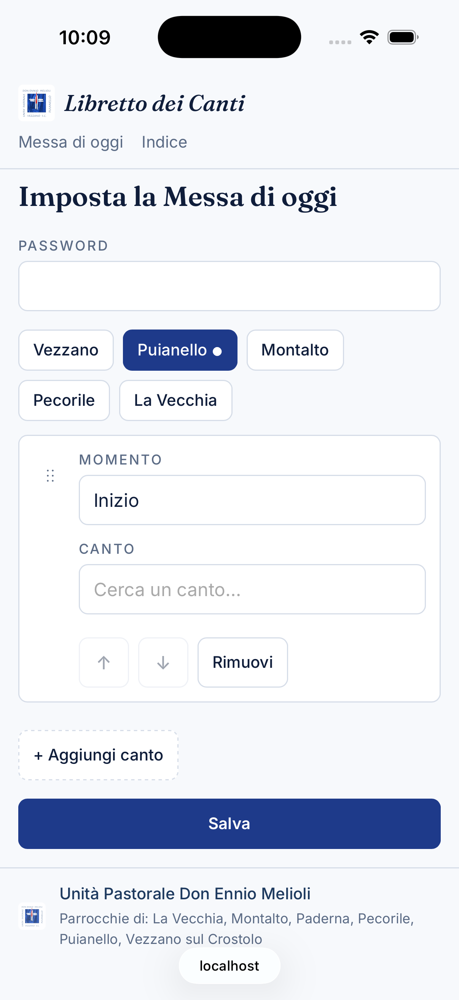

> 📸 **Screenshot 03** — Pagina `/admin` completa, con alcuni canti già inseriti. Aggiungere dei numeri/frecce sopra l'immagine che corrispondano all'elenco qui sotto.

La pagina, dall'alto verso il basso, contiene:

| # | Elemento | A cosa serve |
|---|----------|--------------|
| ① | Titolo **"Imposta la Messa di oggi"** | Conferma che sei nella pagina giusta |
| ② | Campo **Password** | La password di amministrazione, richiesta al salvataggio |
| ③ | Schede delle chiese (**Vezzano**, **Puianello**, **Montalto**, **Pecorile**, **La Vecchia**) | Scegli di quale chiesa stai modificando i canti |
| ④ | Elenco dei canti della chiesa selezionata | Ogni riga è un canto: maniglia ⋮⋮, **Momento**, **Canto**, **↑ ↓**, **Rimuovi** |
| ⑤ | Pulsante **+ Aggiungi canto** | Aggiunge una nuova riga in fondo all'elenco |
| ⑥ | Pulsante **Salva** | Pubblica le modifiche sul libretto |
| ⑦ | Messaggio di stato | Dice se il salvataggio è riuscito o se c'è un errore |

---

## 5. Inserire la password

Scrivi la password di amministrazione nel campo **Password**. I caratteri compaiono come puntini.

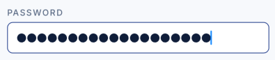

> 📸 **Screenshot 04** — Primo piano del campo "Password" con la password inserita (puntini).

> ⚠️ **Importante:** la password viene controllata **solo quando premi Salva**, non prima. Se è sbagliata te ne accorgi solo in quel momento (vedi [capitolo 14](#14-messaggi-e-problemi-comuni)). Non preoccuparti: le modifiche fatte restano sulla pagina, basta correggere la password e premere di nuovo **Salva**.

---

## 6. Scegliere la chiesa

Sotto la password ci sono le schede delle cinque chiese. Tocca il nome della chiesa che vuoi modificare: la scheda attiva è evidenziata e sotto compare l'elenco dei suoi canti.

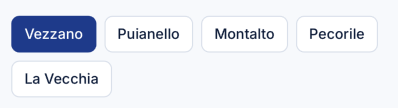

> 📸 **Screenshot 05** — Primo piano delle schede delle chiese, con una scheda (es. "Puianello") selezionata ed evidenziata.

Cose utili da sapere:

- Ogni chiesa ha il **proprio elenco** di canti, indipendente dalle altre.
- Puoi passare da una chiesa all'altra **senza perdere** le modifiche già fatte.
- Le chiese con **modifiche non ancora salvate** mostrano un pallino **●** accanto al nome.
- Un solo **Salva** pubblica **tutte le chiese modificate** insieme. Le chiese che non hai toccato non vengono modificate, anche se nel frattempo un altro amministratore le ha aggiornate.
- Se una chiesa non ha canti, sul libretto i fedeli vedranno la scritta **"Nessun canto impostato."**

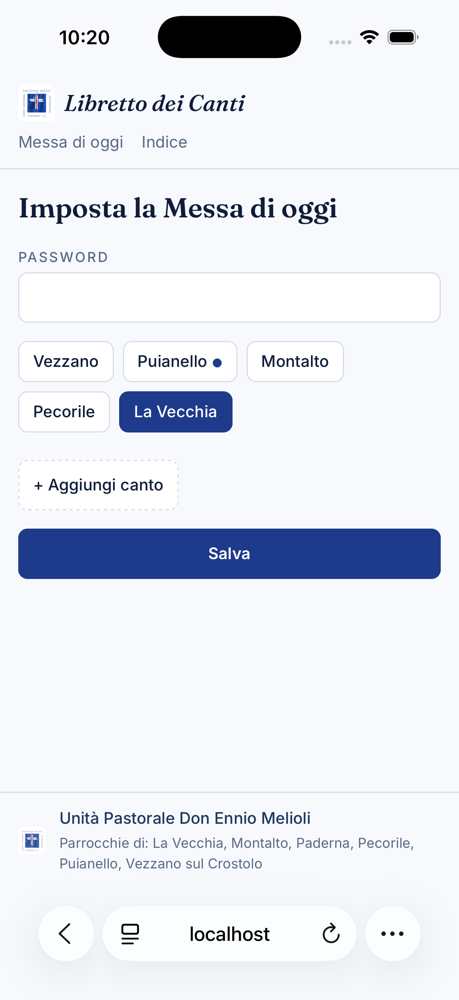

> 📸 **Screenshot 15** — Schede delle chiese con il pallino ● accanto a una chiesa modificata e non ancora salvata.

---

## 7. Aggiungere un canto

1. Con la chiesa giusta selezionata, premi **+ Aggiungi canto**.
2. In fondo all'elenco compare una nuova riga.

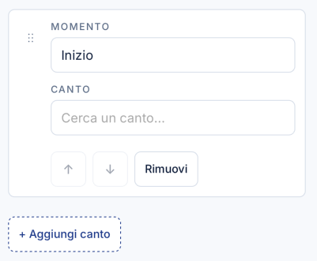

> 📸 **Screenshot 06** — Elenco dopo aver premuto "+ Aggiungi canto": evidenziare la riga nuova in fondo e il pulsante "+ Aggiungi canto".

Il campo **Momento** della nuova riga viene compilato in automatico seguendo l'ordine tipico della Messa:

| Riga | Momento proposto |
|------|------------------|
| 1ª | Inizio |
| 2ª | Offertorio |
| 3ª | Comunione |
| 4ª | Fine |
| dalla 5ª in poi | Canto |

Puoi sempre cambiarlo (vedi [capitolo 9](#9-modificare-il-momento-della-messa)).

Il campo **Canto** della nuova riga è **vuoto** (mostra "Cerca un canto…"): sceglilo come spiegato nel capitolo successivo. Se lo lasci vuoto il salvataggio viene bloccato e ti viene indicata la riga da completare.

---

## 8. Scegliere il canto

Il campo **Canto** è una casella di ricerca.

1. Tocca il campo **Canto**: il testo si svuota e si apre l'elenco di tutti i canti (con il loro numero, se presente).
2. Inizia a scrivere una parte del titolo: l'elenco si restringe mentre scrivi.
   - Non importa se usi maiuscole o minuscole.
   - Non importano gli accenti: scrivendo `pieta` trovi anche "Pietà".
   - Basta una parte qualsiasi del titolo, non per forza l'inizio.
3. Tocca il canto desiderato (o, da tastiera, spostati con le frecce **↑ ↓** e premi **Invio**).
4. L'elenco si chiude e nel campo compare il titolo scelto.

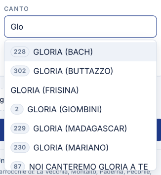

> 📸 **Screenshot 07** — Campo "Canto" aperto con alcune lettere scritte (es. "alle") e l'elenco filtrato sotto, con una voce evidenziata.

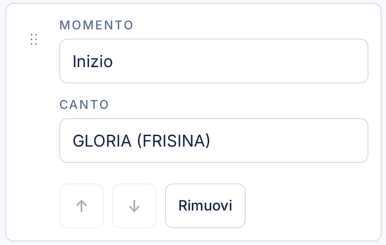

> 📸 **Screenshot 08** — Riga dopo la selezione: il campo "Canto" mostra il titolo scelto.

Altre cose utili:

- Se scrivi qualcosa che non corrisponde a nessun titolo compare **"Nessun canto trovato"**: prova con meno lettere o con un'altra parola del titolo.
- Per chiudere l'elenco senza cambiare canto premi **Esc**, oppure tocca un punto qualsiasi fuori dall'elenco: resta il canto scelto in precedenza.
- Si possono scegliere solo canti presenti nel libretto. Se un canto manca, va prima aggiunto al libretto dal responsabile tecnico.

---

## 9. Modificare il momento della Messa

Il campo **Momento** è un testo libero: è l'etichetta che i fedeli vedono accanto al titolo del canto.

1. Tocca il campo **Momento** della riga.
2. Cancella il testo e scrivi quello che preferisci, ad esempio: `Ingresso`, `Gloria`, `Salmo`, `Alleluia`, `Offertorio`, `Santo`, `Comunione`, `Ringraziamento`, `Congedo`, `Canto mariano`…

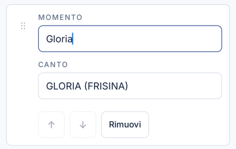

> 📸 **Screenshot 09** — Primo piano di una riga con il campo "Momento" modificato (es. "Gloria").

> ⚠️ **Il campo Momento non può restare vuoto.** Se lo lasci vuoto, premendo **Salva** compare un messaggio come **"Vezzano, riga 2: il momento è vuoto"** e il campo viene evidenziato in rosso. Nulla viene pubblicato finché non lo compili.

---

## 10. Cambiare l'ordine dei canti

I canti appaiono sul libretto **nello stesso ordine** in cui sono nell'elenco. Ci sono due modi per spostarli.

**Con i pulsanti ↑ e ↓ (telefono, tablet e computer)**

- **↑** sposta il canto di una posizione verso l'alto.
- **↓** lo sposta di una posizione verso il basso.
- Sulla prima riga ↑ è disattivato, sull'ultima ↓ è disattivato.

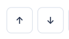

> 📸 **Screenshot 10** — Primo piano di una riga con i pulsanti ↑ e ↓ evidenziati (preferibilmente da telefono).

**Trascinando (computer)**

1. Porta il puntatore sulla **maniglia ⋮⋮** a sinistra della riga ("Trascina per riordinare").
2. Tieni premuto e trascina la riga nella nuova posizione (la destinazione viene evidenziata).
3. Rilascia.

> 💡 **Nota:** spostando una riga il **Momento si sposta con lei**. Se hai scambiato Inizio e Fine, ricordati di correggere anche le etichette.

---

## 11. Rimuovere un canto

Premi **Rimuovi** a destra della riga: la riga sparisce subito.


> 📸 **Screenshot 11** — Primo piano di una riga con il pulsante "Rimuovi" evidenziato.

- Non viene chiesta conferma.
- La rimozione diventa definitiva solo dopo aver premuto **Salva**. Se hai tolto un canto per errore **prima di salvare**, puoi ricaricare la pagina (F5 o trascinando verso il basso sul telefono): tornano i canti dell'ultimo salvataggio, **ma perdi tutte le altre modifiche non salvate**.
- Per svuotare del tutto una chiesa, rimuovi tutte le sue righe e salva: sul libretto comparirà "Nessun canto impostato."

---

## 12. Salvare

Quando hai finito con **tutte** le chiese che dovevi modificare:

1. Controlla che la password sia inserita.
2. Premi **Salva**.
3. Prima di inviare, il sito controlla le righe delle chiese modificate. Se manca qualcosa compare l'elenco dei problemi, ad esempio:
   - **"Vezzano, riga 3: scegli un canto"**
   - **"Puianello, riga 1: il momento è vuoto"**

   I campi da correggere sono evidenziati in rosso e viene aperta la scheda della prima chiesa con un problema. Correggi e premi di nuovo **Salva**.
4. Se tutto è in ordine compare **"Salvataggio…"**. Durante il salvataggio il pulsante **Salva** resta temporaneamente disattivato; se nel frattempo modifichi qualcosa, la modifica viene mantenuta e la chiesa continua a mostrare il pallino ●, quindi ricordati di premere di nuovo **Salva** al termine. Poi compare **"Salvato alle 28/9/2026, 18:30:00."** *(con la data e l'ora del momento)* e i pallini ● delle chiese salvate spariscono.

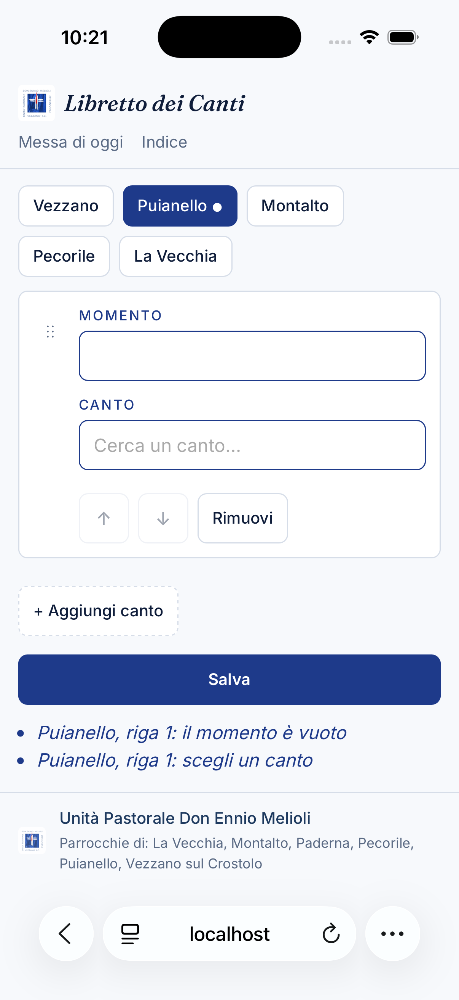

> 📸 **Screenshot 16** — Elenco rosso dei problemi sotto il pulsante "Salva" e una riga con il campo evidenziato in rosso.

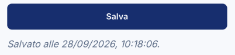

> 📸 **Screenshot 12** — Parte bassa della pagina dopo il salvataggio: pulsante "Salva" e messaggio "Salvato alle …".

Se premi **Salva** senza aver cambiato nulla compare **"Nessuna modifica da salvare."**

**Uscire senza salvare.** Se provi a lasciare la pagina con modifiche non salvate (menu in alto, ricaricamento, chiusura della scheda) il sito ti chiede conferma. Scegli **Annulla** (o **Resta**) per rimanere sulla pagina e salvare.

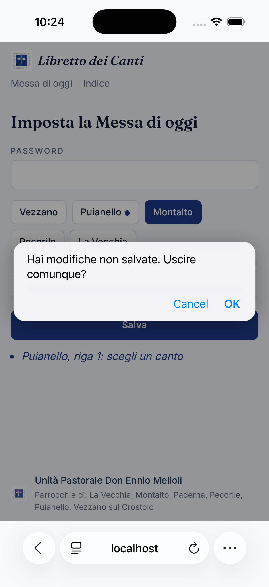

> 📸 **Screenshot 17** — Finestra del browser "Hai modifiche non salvate. Uscire comunque?".

---

## 13. Controllare il risultato

Dopo il salvataggio è buona abitudine controllare cosa vedono i fedeli:

1. Apri la pagina principale del libretto: `https://<INDIRIZZO-DEL-SITO>` (oppure tocca **Messa di oggi** nel menu in alto).
2. Nella sezione **"La Messa di oggi"** tocca la scheda della chiesa che hai modificato.
3. Controlla titoli, ordine e momenti.
4. In fondo, la scritta **"Aggiornato: …"** deve riportare l'ora del tuo salvataggio.

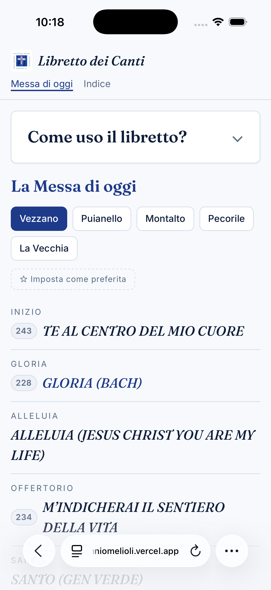

> 📸 **Screenshot 13** — Pagina principale con la chiesa appena modificata selezionata, i canti visibili e la scritta "Aggiornato: …" evidenziata.

> 💡 Chi aveva già il libretto aperto prima del tuo salvataggio **vede ancora la versione vecchia** finché non ricarica la pagina.

---

## 14. Messaggi e problemi comuni

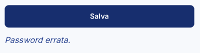

> 📸 **Screenshot 14** — Messaggio di errore in rosso, ad esempio "Password errata.", sotto il pulsante "Salva".

| Messaggio / situazione | Cosa significa | Cosa fare |
|---|---|---|
| **Password errata.** | La password inserita non è corretta. Nulla è stato salvato. | Correggi la password e premi di nuovo **Salva**. Le modifiche sono ancora sulla pagina. |
| **"…, riga N: scegli un canto"** / **"…, riga N: il momento è vuoto"** | Una riga è incompleta. Nulla è stato salvato. | Completa i campi in rosso e premi di nuovo **Salva**. |
| **Nessuna modifica da salvare.** | Non hai cambiato nulla rispetto all'ultimo salvataggio. | Nessuna azione necessaria. |
| **Errore nel salvataggio.** | Il sito ha rifiutato i dati per un motivo imprevisto. | Riprova; se persiste, contatta il responsabile tecnico. |
| **Errore di rete.** | Connessione a internet assente o instabile. | Controlla la connessione e premi di nuovo **Salva** (non ricaricare, perderesti le modifiche). |
| **Errore nel caricamento della lista corrente.** | All'apertura non è stato possibile leggere i canti salvati. **Salva** è disattivato. | Premi **Riprova**. Se persiste, contatta il responsabile tecnico. |
| Un canto salvato in precedenza non compare più nell'elenco | Quel canto è stato tolto dal libretto e viene scartato automaticamente. | Scegli un canto sostitutivo e salva. |
| Sul libretto vedo ancora i canti vecchi | La pagina del libretto non è stata ricaricata. | Ricarica la pagina del libretto. |

---

## 15. Regole d'oro

1. **Un Salva pubblica tutte le chiese modificate** (quelle con il pallino ●), esattamente come le vedi sulla pagina. Le altre chiese restano come sono.
2. **Due amministratori non devono modificare la stessa chiesa nello stesso momento**: vince l'ultimo salvataggio. Chiese diverse invece non si disturbano.
3. **Apri (o ricarica) la pagina `/admin` subito prima di lavorare**, così parti dai canti più recenti.
4. **Verifica il risultato** sulla pagina principale dopo ogni salvataggio.

---

## 16. Riepilogo veloce

1. Apri `https://up-donenniomelioli.vercel.app/admin`.
2. Scrivi la **Password**.
3. Seleziona la **chiesa**.
4. **+ Aggiungi canto** → scegli il **Canto** → controlla il **Momento**.
5. Riordina con **↑ ↓** (o trascinando **⋮⋮**), togli con **Rimuovi**.
6. Ripeti per le altre chiese.
7. **Salva** → correggi eventuali righe in rosso → attendi "Salvato alle …".
8. Controlla la pagina principale.

---

*Per problemi tecnici, password dimenticata o canti mancanti nel libretto contatta: `Riccardo Campani tramite Whatsapp (3662016982)`*
