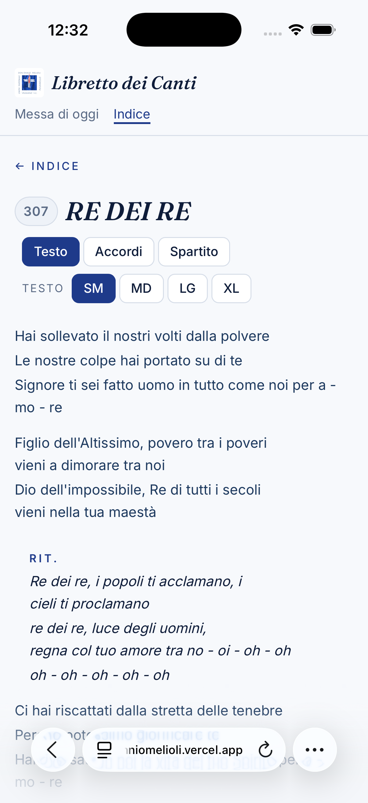
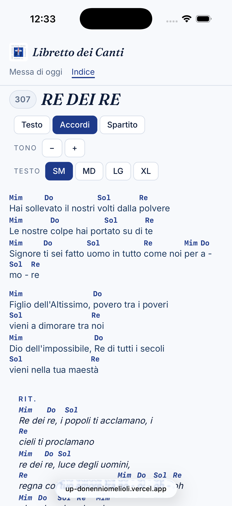
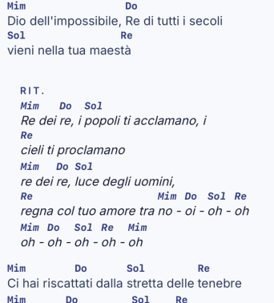

# Manuale per i collaboratori — Proporre canti nuovi e correzioni

*Libretto Digitale dei Canti — Unità Pastorale Don Ennio Melioli*

---

## Indice

1. [A cosa serve](#1-a-cosa-serve)
2. [Come funziona un canto nel libretto](#2-come-funziona-un-canto-nel-libretto)
3. [Cosa inviare](#3-cosa-inviare)
4. [Il titolo](#4-il-titolo)
5. [Il numero del libretto cartaceo](#5-il-numero-del-libretto-cartaceo)
6. [Il testo](#6-il-testo)
7. [Il ritornello](#7-il-ritornello)
8. [Note, indicazioni e voci](#8-note-indicazioni-e-voci)
9. [Gli accordi](#9-gli-accordi)
10. [Come si scrivono gli accordi](#10-come-si-scrivono-gli-accordi)
11. [Lo spartito in PDF](#11-lo-spartito-in-pdf)
12. [Correggere un canto esistente](#12-correggere-un-canto-esistente)
13. [Come inviare la richiesta](#13-come-inviare-la-richiesta)
14. [Errori comuni](#14-errori-comuni)
15. [Esempio completo](#15-esempio-completo)
16. [Modulo da copiare](#16-modulo-da-copiare)
17. [Controllo finale](#17-controllo-finale)

---

## 1. A cosa serve

Il libretto digitale raccoglie i canti usati nelle celebrazioni dell'Unità Pastorale. I canti vengono inseriti nel libretto dal responsabile tecnico, ma **trascriverli richiede molto tempo**: testo, ritornelli, accordi, controlli.

Questo manuale spiega **come preparare un canto** (nuovo o da correggere) in modo che sia già scritto nel formato usato dal libretto. Se segui queste regole, il responsabile tecnico deve solo controllarlo e pubblicarlo, senza riscrivere nulla.

Non serve nessun programma particolare e non serve saper usare un computer in modo avanzato: basta un messaggio di testo scritto con cura.

---

## 2. Come funziona un canto nel libretto

Ogni canto nel libretto è fatto di poche parti:

| Parte | Obbligatoria? | Dove si vede |
|---|---|---|
| **Titolo** | Sì | Nell'indice, nella ricerca, in cima alla pagina del canto, nella "Messa di oggi" |
| **Numero** del vecchio libretto cartaceo | No | Un piccolo riquadro con il numero accanto al titolo |
| **Testo** (con o senza accordi) | Sì | Nella pagina del canto |
| **Spartito PDF** | No | Nella pagina del canto, pulsante **Spartito** |



> 📸 **Screenshot 01** — Pagina di un canto da telefono: numero nel riquadro, titolo, pulsanti (Testo / Accordi / Spartito, dimensione del testo) e testo con il ritornello evidenziato.

Nella pagina del canto i fedeli possono:

- leggere **solo il testo** (vista normale);
- attivare gli **Accordi**, che compaiono sopra le sillabe giuste;
- cambiare **Tono** (pulsanti **−** e **+**): tutti gli accordi vengono spostati automaticamente;
- aprire lo **Spartito** in PDF, se presente.



> 📸 **Screenshot 02** — Lo stesso canto con gli accordi attivi: accordi sopra le sillabe e pulsanti "Tono − +".

Testo e accordi sono scritti **insieme, nello stesso testo**: è il motivo per cui le regole dei capitoli seguenti sono importanti. Un accordo scritto nel posto sbagliato compare sopra la sillaba sbagliata.

---

## 3. Cosa inviare

Per ogni canto prepara:

1. **Titolo** (vedi [capitolo 4](#4-il-titolo)).
2. **Numero** del libretto cartaceo, se il canto c'era (vedi [capitolo 5](#5-il-numero-del-libretto-cartaceo)).
3. **Testo completo**, scritto secondo le regole dei capitoli [6](#6-il-testo), [7](#7-il-ritornello) e [8](#8-note-indicazioni-e-voci).
4. **Accordi** dentro al testo, se li conosci (capitoli [9](#9-gli-accordi) e [10](#10-come-si-scrivono-gli-accordi)). Sono facoltativi: un canto senza accordi va benissimo.
5. **Spartito PDF**, se ce l'hai (capitolo [11](#11-lo-spartito-in-pdf)). Facoltativo.

Il modo più semplice è copiare il [modulo del capitolo 16](#16-modulo-da-copiare) e compilarlo.

> 💡 Un canto **solo testo, scritto bene**, è molto più utile di un canto con accordi incerti. Gli accordi si possono aggiungere anche in un secondo momento.

---

## 4. Il titolo

Regole:

- **Tutto in MAIUSCOLO**: `SERVO PER AMORE`, non `Servo per amore`.
- **Con gli accenti**: `QUALE GIOIA È STAR CON TE`, `ALLELUIA (TAIZÉ)`. Usa la **È** maiuscola accentata, non `E'`.
- **Senza punto finale.**
- Se esistono **più canti con lo stesso titolo** (molti Alleluia, Santo, Agnello di Dio…), aggiungi tra parentesi **cosa li distingue**: l'autore, la comunità, la raccolta o le prime parole.

  ```
  ALLELUIA (GEN)
  ALLELUIA (PASSERANNO I CIELI)
  AGNELLO DI DIO (RNS)
  SANTO (A DUE VOCI)
  MAGNIFICAT (LOMBARDI)
  ```

- Per salmi e cantici biblici si può indicare il riferimento: `ATTINGERETE ACQUA CON GIOIA (ISAIA 12)`.

Il titolo decide anche la **posizione nell'indice** (ordine alfabetico) e come il canto si trova con la **ricerca**. Scegli il titolo con cui la gente lo cerca davvero, di solito le prime parole del ritornello o il titolo con cui è conosciuto.

> ⚠️ Prima di proporre un canto nuovo **cercalo nel libretto** (`https://up-donenniomelioli.vercel.app/canti`): potrebbe esserci già con un titolo leggermente diverso. In quel caso proponi una correzione (vedi [capitolo 12](#12-correggere-un-canto-esistente)).

---

## 5. Il numero del libretto cartaceo

Molti canti hanno un **numero** che corrisponde al vecchio libretto stampato. Nel libretto digitale compare in un riquadro accanto al titolo, così chi è abituato al numero lo ritrova.

- Se il canto era nel libretto cartaceo, **indica il suo numero**.
- Se il canto è nuovo e non aveva numero, **lascia vuoto**. Non inventare numeri.

---

## 6. Il testo

Il testo si scrive **esattamente come deve apparire**, riga per riga.

**Righe**

- **Ogni riga del messaggio è una riga sul libretto.** Vai a capo dove vuoi che si vada a capo.
- Non scrivere righe troppo lunghe: sul telefono una riga lunga viene spezzata in automatico, ma diventa difficile da seguire. Una riga = un verso.

**Strofe**

- Tra una strofa e l'altra lascia **una riga vuota**.
- **Non** lasciare righe vuote *dentro* una strofa.
- Non serve numerare le strofe (niente `1.`, `2.`, `Strofa 1`): la riga vuota basta.

**Punteggiatura e maiuscole**

- Scrivi il testo in **maiuscolo/minuscolo normale**, come in un libro (solo il titolo è tutto maiuscolo).
- Copia la punteggiatura dalla fonte ufficiale (virgole, punti, punti esclamativi).
- Usa le maiuscole di rispetto se la fonte le usa: `Tu`, `Signore`, `Spirito`.
- Gli apostrofi vanno bene sia dritti `'` sia tipografici `’`.

**Ripetizioni**

- Scrivi il testo **per intero, nell'ordine in cui si canta**. Se una strofa si canta due volte, scrivila due volte.
- Se una sola riga si ripete subito, puoi indicarlo con una nota alla fine: `… tutti avvolgerà. (2 volte)`.

**Esempio — strofe**

```
Solo una goccia hai messo fra le mani mie,
solo una goccia che Tu ora chiedi a me,
una goccia che in mano a Te una pioggia diventerà
e la terra feconderà.

Le nostre gocce, pioggia fra le mani tue,
saranno linfa di una nuova civiltà.
E la terra preparerà la festa del pane che
ogni uomo condividerà.
```

---

## 7. Il ritornello

Il ritornello ha una regola precisa, perché il libretto lo **riconosce e lo evidenzia** in automatico.

1. Scrivi **`RIT.`** da solo su una riga (maiuscolo, con il punto).
2. Sotto, il testo del ritornello.
3. **Dopo il ritornello lascia una riga vuota.** Il libretto considera "ritornello" tutto quello che sta tra `RIT.` e la prima riga vuota.
4. **Riscrivi il ritornello per intero ogni volta che si canta**, non scrivere solo `RIT.` da solo: chi legge dal telefono non deve scorrere su e giù.

```
RIT.
Ecco quel che abbiamo, nulla ci appartiene ormai.
Ecco i frutti della terra, che Tu moltiplicherai.
Ecco queste mani: puoi usarle, se lo vuoi,
per dividere nel mondo il pane che Tu hai dato a noi.

Solo una goccia hai messo fra le mani mie,
solo una goccia che Tu ora chiedi a me,
…

RIT.
Ecco quel che abbiamo, nulla ci appartiene ormai.
…
```



> 📸 **Screenshot 03** — Primo piano di un canto con l'etichetta "RIT." e il ritornello evidenziato rispetto alle strofe.

> ⚠️ **Non scrivere** `Rit:`, `Ritornello`, `R.` o `RIT. Ecco quel che abbiamo…` sulla stessa riga: il libretto riconosce solo `RIT.` **da solo su una riga**.

Se il canto **inizia con il ritornello**, la prima riga del testo è `RIT.`.

---

## 8. Note, indicazioni e voci

**Indicazioni per chi canta o suona** (chi canta, momenti strumentali, letture…) vanno **tra parentesi tonde**, di solito su una riga da sole:

```
(lettura versetto)
(solo chitarre)
(1 strofa strumentale)
(rientrano tutti)
```

> ⚠️ Per le note usa **sempre le parentesi tonde `( )`**. Le parentesi quadre `[ ]` sono riservate agli accordi: tutto quello che è tra quadre viene mostrato come un accordo (vedi [capitolo 10](#10-come-si-scrivono-gli-accordi)).

**Canti a più voci.** Se il canto alterna gruppi, metti all'inizio della riga una sigla seguita dai due punti:

| Sigla | Significato |
|---|---|
| `U:` | Uomini |
| `D:` | Donne |
| `S:` | Solista |
| `T:` | Tutti / assemblea |

```
U: Santo il Signore Dio dell'universo
D: È Santo, Santo, Santo il Signore della vita

(U + D insieme)
U: Santo il Signore Dio dell'universo
D: È Santo, Santo, Santo il Signore della vita
```

La sigla vale fino al cambio successivo: non serve ripeterla su ogni riga.

---

## 9. Gli accordi

Gli accordi sono **facoltativi**. Se li conosci con sicurezza, aggiungerli è il modo più utile per aiutare chi suona.

**Dove si scrivono.** L'accordo si scrive **tra parentesi quadre, attaccato subito prima della sillaba** su cui si cambia accordo. Il libretto lo mostrerà proprio sopra quella sillaba.

```
L’anima [Fa]mia ma[Fa7+]gnifica il Si[Fa6]gnore
```

diventa, con gli accordi attivi:

```
        Fa   Fa7+          Fa6
L’anima mia magnifica il Signore
```

Regole:

- L'accordo può stare **anche a metà parola** (`ma[Fa7+]gnifica`), se il cambio cade su quella sillaba. Non spezzare la parola con spazi.
- **Niente spazio** tra l'accordo e la sillaba: `[Do]Dio`, non `[Do] Dio`.
- Se l'accordo cade **dopo l'ultima parola** della riga, mettilo in fondo: `Si[Fa4]gnore.[Fa]`
- Più accordi sulla stessa sillaba si scrivono uno dopo l'altro: `[Sol][Sol4]gloria`.
- Scrivi gli accordi **nella tonalità in cui il canto si suona davvero** in parrocchia. Chi ha bisogno di un'altra tonalità usa i pulsanti **Tono − +**.
- Se metti gli accordi, mettili **in tutto il canto**, anche nei ritornelli ripetuti.

**Introduzioni e parti strumentali.** Una riga fatta **solo di accordi**, separati da uno spazio, è un'introduzione o un intermezzo. Quando gli accordi sono spenti il libretto la nasconde automaticamente.

```
[Do] [Mim] [Do] [Re7] [Sol]
RIT.
[Sol]Allelu[Do]ia, [Sol]Allelu[Fa]ia, [Do]Alle[Mim]luia, [Do]Alle[Re7]lu[Sol]ia.
```

Se vuoi descrivere l'introduzione a parole, usa una nota tra tonde: `(intro: prime due righe del ritornello, strumentale)`.

> 💡 **Non conosci gli accordi di una parte?** Lascia quella parte senza accordi e scrivilo nelle note della richiesta. Meglio un buco dichiarato che un accordo inventato.

---

## 10. Come si scrivono gli accordi

Usa la **notazione italiana**: `Do Re Mi Fa Sol La Si`, con la **prima lettera maiuscola**.

| Tipo di accordo | Come si scrive | Esempi |
|---|---|---|
| Maggiore | solo il nome | `[Do]` `[Sol]` `[Fa]` |
| Minore | nome + **m** | `[Lam]` `[Mim]` `[Rem]` |
| Diesis | **#** | `[Fa#]` `[Fa#m]` `[Do#m]` |
| Bemolle | **b** minuscola | `[Sib]` `[Mib]` `[Sibm]` |
| Settima | **7** | `[Sol7]` `[La7]` `[Mim7]` |
| Settima maggiore | **7+** | `[Fa7+]` `[Do7+]` |
| Sospeso (4ª) | **4** | `[Re4]` `[La4]` |
| Sesta, nona | **6**, **9** | `[Fa6]` `[Re9]` |
| Basso diverso | **/** + nota del basso | `[Do/Mi]` `[Sib/Do]` |

**Da evitare** (vengono letti male o non si trasportano bene):

| ❌ Non scrivere | ✅ Scrivi |
|---|---|
| `[La-]` (meno per il minore) | `[Lam]` |
| `[Fa+7]`, `[Si+]` | `[Fa7]`, `[Si]` |
| `[Sol/4]` (barra con un numero) | `[Sol][Sol4]` |
| `[la7]`, `[DO]` (maiuscole sbagliate) | `[La7]`, `[Do]` |
| `[Dol]` e altri errori di battitura | `[Do]` |
| `[INTRO: …]`, `[come sopra]` | `(intro: …)`, `(come sopra)` |
| Accordi su una riga separata sopra il testo | Accordi **dentro** il testo tra quadre |

> ⚠️ **Accordi "sopra la riga".** Molti siti e libretti scrivono gli accordi su una riga a parte, sopra il testo. **Non copiarli così**: sul telefono le colonne si disallineano. Sposta ogni accordo dentro il testo, prima della sillaba giusta.
>
> ❌ Non così:
>
> ```
> Do        Sol      Lam
> Se il sole non illuminasse più
> ```
>
> ✅ Così:
>
> ```
> [Do]Se il sole non [Sol]illumi[Lam]nasse più
> ```

La notazione inglese (`C`, `G`, `Am`) funziona ugualmente, ma per uniformità con il resto del libretto **preferisci quella italiana**. Non mescolare le due nello stesso canto.

---

## 11. Lo spartito in PDF

Se hai lo **spartito** del canto (partitura, accordi impaginati, ecc.) puoi allegarlo come **file PDF**. Comparirà nella pagina del canto con il pulsante **Spartito**.

- Un solo PDF per canto.
- Deve essere **leggibile da telefono**: scansioni dritte, nitide, non foto storte.
- Se hai solo foto o immagini, mandale comunque: il responsabile tecnico valuterà se convertirle.
- Non serve rinominare il file: lo fa il responsabile tecnico.

> ⚠️ Lo spartito **non sostituisce il testo**: il testo scritto serve comunque, perché è quello che si legge, si cerca e si ingrandisce.

> ⚠️ Invia solo materiale che si può pubblicare. Molti spartiti sono protetti da diritti d'autore: se hai dubbi, segnalalo nella richiesta.

---

## 12. Correggere un canto esistente

Se un canto del libretto ha un errore (parola sbagliata, accordo sbagliato, strofa mancante, numero sbagliato) o vuoi aggiungere gli accordi:

1. Apri il canto nel libretto e **copia l'indirizzo della pagina** dalla barra del browser (es. `https://up-donenniomelioli.vercel.app/canti/ecco-quel-che-abbiamo`). Così non ci sono dubbi su quale canto sia.
2. Descrivi **cosa cambia** in una frase (es. "aggiunti gli accordi", "nella 2ª strofa è *frutti*, non *fiori*").
3. Per correzioni piccole basta indicare la riga: `strofa 2, riga 3: "…" → "…"`.
4. Per correzioni grandi (accordi aggiunti, strofe riordinate) **manda il testo completo corretto**, scritto con le regole di questo manuale.

**Cambiare il titolo** di un canto esistente si può, ma ricordati che il titolo nuovo cambia la posizione nell'indice: scrivilo esplicitamente nella richiesta.

**Togliere un canto** dal libretto: chiedilo spiegando il motivo. Attenzione: se il canto è in uso nella "Messa di oggi" di qualche chiesa, sparirà anche da lì.

---

## 13. Come inviare la richiesta

Invia la richiesta al responsabile tecnico (contatto in fondo al manuale), preferibilmente su **WhatsApp** o per email.

- **Un messaggio per canto.** Se mandi più canti, separali bene o mandali in messaggi diversi.
- Scrivi il testo **direttamente nel messaggio**, oppure in un **file di testo semplice** (`.txt`). Va bene anche un documento Word, ma **non** una foto o un PDF del testo: andrebbe ricopiato a mano, ed è proprio quello che vogliamo evitare.
- Se scrivi su Word o sul telefono, attenzione alla **correzione automatica**: può trasformare `Lam` in `Lama`, `Sib` in `Sì b`, mettere la maiuscola dopo `[Do]`, ecc. Rileggi prima di inviare.
- Allega lo spartito PDF, se c'è, nello stesso messaggio.
- Indica **la fonte** del testo (libretto, sito, raccolta, CD): serve per i controlli.

Dopo il controllo il canto viene pubblicato. Se ci sono dubbi verrai contattato.

---

## 14. Errori comuni

| Errore | Cosa succede nel libretto | Come fare |
|---|---|---|
| Ritornello scritto `Rit:` o `Ritornello` | Non viene riconosciuto né evidenziato | Scrivi `RIT.` da solo su una riga |
| Manca la riga vuota dopo il ritornello | Anche la strofa successiva viene evidenziata come ritornello | Lascia una riga vuota dopo ogni ritornello |
| Scritto solo `RIT.` senza testo | Chi legge non sa cosa cantare | Riscrivi il ritornello per intero |
| Note tra parentesi quadre | La nota viene mostrata come un accordo | Usa le parentesi tonde `( )` |
| Accordi su una riga sopra il testo | Accordi disallineati sul telefono | Accordi tra quadre dentro il testo |
| Spazio tra accordo e sillaba | L'accordo compare spostato | Attacca l'accordo alla sillaba: `[Do]Dio` |
| Accordi solo in metà canto | Chi suona resta a metà | Accordi in tutto il canto, o in nessuna parte |
| Titolo in minuscolo o senza distinzione | Canti con lo stesso nome indistinguibili | MAIUSCOLO + distinzione tra parentesi |
| Testo inviato come foto | Va ricopiato a mano | Invia testo scritto |
| Strofe numerate (`1.`, `2.`) | I numeri compaiono nel testo | Separa le strofe con una riga vuota |

---

## 15. Esempio completo

Ecco come appare una richiesta pronta da pubblicare:

````
TITOLO: ALLELUIA (GEN)
NUMERO:
FONTE: libretto del coro di Vezzano
SPARTITO: no
NOTE: nessuna

TESTO:
[Do] [Mim] [Do] [Re7] [Sol]
RIT.
[Sol]Allelu[Do]ia, [Sol]Allelu[Fa]ia, [Do]Alle[Mim]luia, [Do]Alle[Re7]lu[Sol]ia.
[Sol]Allelu[Do]ia, [Sol]Allelu[Fa]ia, [Do]Alle[Mim]luia, [Do]Alle[Re7]lu[Sol]ia.

(lettura versetto)

RIT.
[Sol]Allelu[Do]ia, [Sol]Allelu[Fa]ia, [Do]Alle[Mim]luia, [Do]Alle[Re7]lu[Sol]ia.
[Sol]Allelu[Do]ia, [Sol]Allelu[Fa]ia, [Do]Alle[Mim]luia, [Do]Alle[Re7]lu[Sol]ia.
````

E una correzione:

````
CORREZIONE: https://up-donenniomelioli.vercel.app/canti/ecco-quel-che-abbiamo
COSA CAMBIA: strofa 1, riga 2: "che Tu ora chiedi a me" → "che Tu ora chiedi a me," (manca la virgola)
````

---

## 16. Modulo da copiare

Copia questo modulo, compilalo e invialo. Lascia vuote le voci che non ti riguardano.

````
TITOLO:
NUMERO:
FONTE:
SPARTITO: sì / no
NOTE:

TESTO:

````

Per una correzione:

````
CORREZIONE: (indirizzo della pagina del canto)
COSA CAMBIA:
TESTO CORRETTO: (solo per correzioni grandi)
````

---

## 17. Controllo finale

Prima di inviare, rileggi e controlla:

1. ☐ Il canto **non c'è già** nel libretto (o, se c'è, sto mandando una correzione).
2. ☐ Il **titolo** è in MAIUSCOLO, con gli accenti, ed è distinguibile da canti simili.
3. ☐ Ho indicato il **numero** del libretto cartaceo, se esiste.
4. ☐ Ogni **strofa** è separata da **una** riga vuota; nessuna riga vuota dentro le strofe.
5. ☐ Ogni **ritornello** inizia con `RIT.` da solo su una riga, è scritto per intero ed è seguito da una riga vuota.
6. ☐ Le **note** sono tra parentesi tonde `( )`.
7. ☐ Gli **accordi** (se presenti) sono tra quadre `[ ]`, attaccati alla sillaba, in notazione italiana, in tutto il canto.
8. ☐ Ho controllato che la **correzione automatica** non abbia cambiato nulla.
9. ☐ Ho indicato la **fonte** e allegato lo **spartito**, se c'è.

---

*Per domande, dubbi o per inviare i canti contatta: `Riccardo Campani tramite Whatsapp (3662016982)`*
